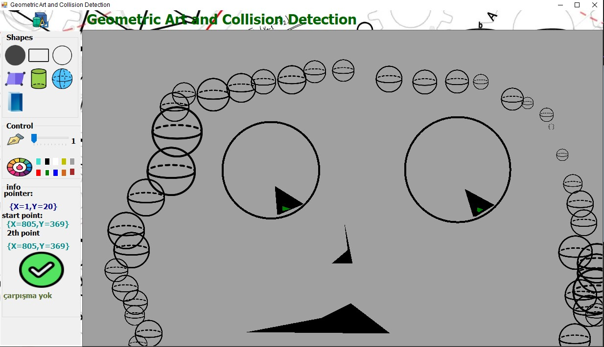

# GeoSketch - Geometric Drow and Collision Detection

GeoSketch is a C# program that combines the joy of sketching with the power of collision detection for geometric shapes. With GeoSketch, you can unleash your creativity by drawing various geometric shapes and explore their interactions in real-time.

## Features

- **Sketch and Draw:** GeoSketch provides a user-friendly drawing board that allows you to sketch and draw different geometric shapes effortlessly. Choose from a wide range of tools to create lines, circles, rectangles, and more.

- **Collision Detection:** One of the core features of GeoSketch is its advanced collision detection engine. It automatically detects and highlights any intersections or overlaps between the geometric shapes you draw. This functionality lets you experiment and observe how shapes interact with each other.

## Download

You can download the latest version of GeoSketch from the [Releases](https://github.com/your-repository/releases) section of this repository. Choose the appropriate version for your operating system and follow the installation instructions provided.

## Getting StDrowed

To get stDrowed with GeoSketch, follow these steps:

1. Download and install the program from the link provided in the Download section.

1. Launch GeoSketch on your computer.

1. Begin by selecting a drawing tool from the toolbar. For example, you can choose the "Point" tool to draw points, or the "Circle" tool to create circles.

1. Use your mouse or input device to sketch and draw on the canvas. Let your imagination run wild and experiment with different shapes and arrangements.

1. As you draw, GeoSketch will automatically detect and highlight any intersections or overlaps between the shapes. This visual feedback helps you understand the collision behavior of the geometric objects.

1. Feel free to save your creations, export them as images, or stDrow a new sketch whenever you like.

## Contributing

If you want to contribute to GeoSketch, you're welcome to submit bug reports, feature requests, or pull requests to the [GitHub repository](https://github.com/your-repository). Please check the contribution guidelines for more information on how to get involved.

## License

GeoSketch is released under the [MIT License](LICENSE), which means you're free to use, modify, and distribute the program as per the terms of the license.

## Acknowledgements

We would like to express our gratitude to the open-source community for their valuable contributions and the libraries and frameworks that made GeoSketch possible.

